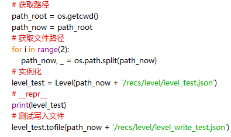
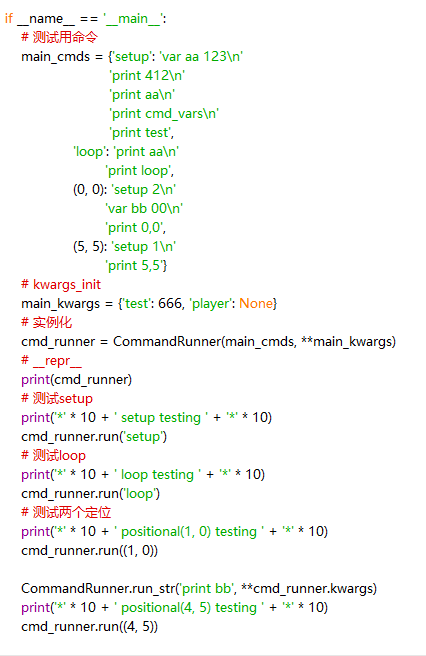

# FileIO文档

## Level 类：
**1.初始化**：

给一个json文件的路径
文件主体为字典
文件中，必须有名为{'name', 'rec', 'bg', 'spawn_point', 'preentities', 'commands'}的键
返回一个Level对象

**2.属性：**
>path：str：初始化时的路径

>_moblist：set：生物集合

>_cmd_runner：CommandRunner\

>以及所有json文件里的键与值

**3.方法：**

> tofile（path： str）：将此对象的所有不以_开头的属性写入path所指文件，以json格式

`所以如果属性不应写入文件，请在前面加_`

****注：目前没有预生成实体***

----------

## CommandRunner类：
**1.初始化：**

给一个写有命令的字典，键为setup，loop或表示坐标的元组,值为命令的字符串\
还可以给初始化时的关键字参数

**2.属性：**

>setup，loop，positional：分别代表初始化，循环，定位命令

>cmd_vars：dict：变量存储

>kwargs：获取kwargs，即有特殊含义的字符串

**3.方法：**

>静态方法：var_dealing（cmd：str，**kwargs）处理cmd中的变量，特殊字符串等，返回处理后的cmd

>静态方法：run_str（cmd：str，**kwargs）处理并运行cmd字符串

>run（cmd_type）传入setup，loop或当前坐标的元组，以运行相应的命令

